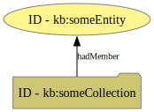
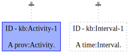
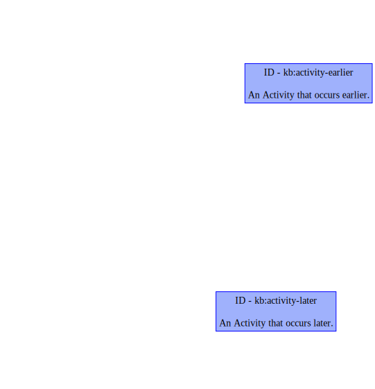
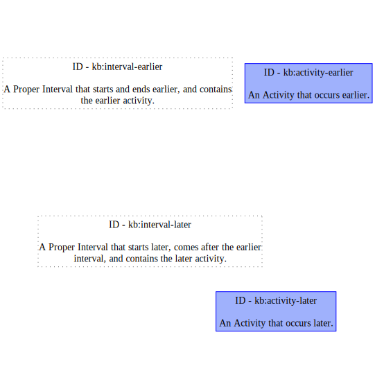
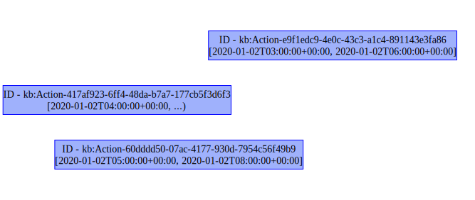
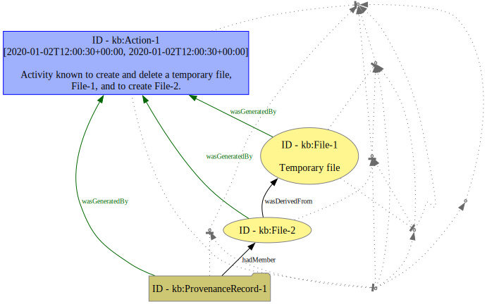

# CASE Implementation: PROV-O

[](https://github.com/casework/CASE-Implementation-PROV-O/actions/workflows/cicd.yml)


This repository maps [CASE](https://caseontology.org/) to [W3C PROV-O](https://www.w3.org/TR/prov-o/) and [OWL-Time](https://www.w3.org/TR/owl-time/), and provides a provenance review mechanism.  Note that contrary to other CASE implementations, this maps CASE out to another data model, instead of mapping another data model or tool into CASE.


## Disclaimer

Participation by NIST in the creation of the documentation of mentioned software is not intended to imply a recommendation or endorsement by the National Institute of Standards and Technology, nor is it intended to imply that any specific software is necessarily the best available for the purpose.


## Usage

This repository can be installed from PyPI or from source.


### Installing from PyPI

```bash
pip install case-prov
```


### Installing from source

Users who wish to install pre-release versions and/or make improvements to the code base should install in this manner.

1. Clone this repository.
2. (Optional) Create and activate a virtual environment.
3. (Optional) Upgrade `pip` with `pip install --upgrade pip`.  (This can speed installation of some dependent packages.)
4. Run `pip install $x`, where `$x` is the path to the cloned repository.

Local installation is demonstrated in the `.venv.done.log` target of the `tests/` directory's [`Makefile`](tests/Makefile).


### Usage and testing

The [tests](tests/) directory demonstrates the three standalone scripts run against CASE example JSON-LD data.
* `case_prov_rdf` - This script takes as input one or more CASE graph files, and outputs a graph file that adds annotations to the CASE nodes that serve as a standalone PROV-O graph.
* `case_prov_dot` - This script takes as input one or more PROV-O graph files, and outputs a Dot render.
* `case_prov_check` - This script takes as input one or more graph files, and reviews data for OWL consistency according to PROV-O (e.g. ensuring no one graph individual is a member of two PROV-O disjoint sets), and for breaks in chain of custody.

On using `case_prov_rdf.py` to create a PROV-O graph, it is possible to provide that graph to a PROV-O consumer, such as a [PROV-CONSTRAINTS](https://www.w3.org/TR/prov-constraints/) validator.  This CASE project runs a Python package listed on the [W3C 2013 implementations report](https://www.w3.org/TR/2013/NOTE-prov-implementations-20130430/), [`prov-check`](https://github.com/pgroth/prov-check), as part of its sample output.  For instance, the [CASE-Examples repository](https://github.com/casework/CASE-Examples) is analyzed [here](tests/CASE-Examples/examples/prov-constraints.log).

All of the demonstration rendering (to PROV-O and to SVG images) can be run by cloning this repository and running (optionally with `-j`):

```bash
make
```

Be aware that some resources will be downloaded, including [Git submodules](.gitmodules), a Java tool used by the CASE community to normalize Turtle-formatted data, and PyPI packages.  External resources not from PyPI are versioned as Git records.  PyPI packages, [listed](tests/requirements.txt) in the tests directory, are purposefully imported at up-to-date versions instead of locking a specified version.


## Development status

This repository follows [CASE community guidance on describing development status](https://caseontology.org/resources/github_policies.html#development-statuses), by adherence to noted support requirements.

The status of this repository is:

4 - Beta


## Versioning

This project follows [SEMVER 2.0.0](https://semver.org/) where versions are declared.


## Ontology versions supported

This repository supports the CASE and UCO ontology versions that are distributed with the [CASE-Utilities-Python repository](https://github.com/casework/CASE-Utilities-Python), at the newest version below a ceiling-pin in [setup.cfg](setup.cfg).  Currently, those ontology versions are:

* CASE 1.2.0
* UCO 1.2.0


## Repository locations

This repository is available at the following locations:
* [https://github.com/casework/CASE-Implementation-PROV-O](https://github.com/casework/CASE-Implementation-PROV-O)
* [https://github.com/usnistgov/CASE-Implementation-PROV-O](https://github.com/usnistgov/CASE-Implementation-PROV-O) (a mirror)

Releases and issue tracking will be handled at the [casework location](https://github.com/casework/CASE-Implementation-PROV-O).


## Make targets

Some `make` targets are defined for this repository:
* `all` - Build PROV-O mapping files based on CASE examples, and generate figures.
  - **Non-Python dependency** - Figures require [`dot`](https://graphviz.org/) be installed.
* `check` - Run unit tests.
* `clean` - Remove built files.
* `distclean` - Also remove test-installation artifacts.

Note that the `all` and `check` targets will trigger a download of a Java content normalizer, to apply the ontology process described in [CASE's normalization procedures](https://github.com/casework/CASE/blob/master/NORMALIZING.md).


## Design notes

This repository maps CASE to PROV-O by the use of SPARQL `CONSTRUCT` queries, listed [here](case_prov/queries/).

Both direct relationships and qualified relationships are implemented, according to data tied to CASE `InvestigativeAction`s.  For example, [the `CONSTRUCT` query for `prov:actedOnBehalfOf`](case_prov/queries/construct-actedOnBehalfOf.sparql)) directly relates an action's instrument as a delegated agent of the action's performer.  This is built as a qualified, annotatable relationship with [the `CONSTRUCT` query for `prov:Delegation`](case_prov/queries/construct-Delegation.sparql)).

One CASE practice that might look non-obvious in the PROV context is CASE's representation of an initial evidence submission.  CASE represents this by an `InvestigativeAction` that has no inputs.  For a simplification of chain of custody querying, this project represents this as actions that use, and entities that are derived from, the empty set, `prov:EmptyCollection`.  (This is implemented in [this query](case_prov/queries/construct-used-nothing.sparql)).


## Visual-design notes

Some of the tests include small galleries of figures that are tracked as documentation.  Other figures can be generated by an interested user, but are not version-controlled at the moment.

See for example:
* [The CASE website narrative "Urgent Evidence"](tests/casework.github.io/examples/urgent_evidence/#readme)

The following notes describe visual-design decisions.


### Visual-design credits

The `case_prov_dot` module adopts the design vocabulary used by Trung Dong Huynh's MIT-licensed Python project [`prov`](https://github.com/trungdong/prov).  `prov`'s [short tutorial landing page](https://trungdong.github.io/prov-python-short-tutorial.html) illustrates the shape and color selections for various nodes, edges, and annotations.  The `case_prov_dot` program uses this instead of the W3C's design vocabulary, illustrated in [Figure 1 of the PROV-O documentation page](https://www.w3.org/TR/prov-o/#starting-points-figure), because of the greater color specificity used for the various between-node-class edges.

The version of `prov` that `case_prov_dot` draws its designs from is tracked as a Git submodule.  This tracking is not for any purpose of importing code.  The [`prov.dot` package](https://github.com/trungdong/prov/blob/2.0.0/src/prov/dot.py) is imported as a library for its styling dictionaries, though this CASE project implements its own dot-formatted render to implement some extending design decisions, some of which are specific to CASE concepts.

[Conventions provided by the W3C](https://www.w3.org/2011/prov/wiki/Diagrams) were found after initial design of this section.  Color selection has not been compared, but directional flow has been adopted.  Notably, **time flows from up to down**, and "Arrows point 'back into the past.'"


### Departures from original visual-design vocabularies


#### Activity-activity edges

Both the illustration in W3C PROV-O's Figure 1, and the edge colors in the `prov` project, assign black to both `wasInformedBy` and `wasDerivedFrom`.  This CASE project opts to distinguish `wasInformedBy` by coloring its edges a shade of blue.


#### Activity labels

Activity labels in this CASE project include the activity's time interval, using closed interval notation for recorded times, and an open interval end with ellipsis for absent times.


#### Provenance records as collections

A `prov:Collection` is a subclass of a `prov:Entity`.  To distinguish `prov:Collection`s that are CASE `investigation:ProvenanceRecord`s, versus other `prov:Entity`s, a slightly different yellow is used, as well as a different shape.

The label form is also adjusted to include a CASE `exhibitNumber`, when present.




#### Edge weights

The PROV-O model provides direct-relationship predicates, and qualified relationships that *imply* the same direct structure but instead use an annotatable qualification object.  This CASE project illustrates PROV-O direct relationships, but makes one difference from the original `prov` visual-design vocabulary, using edge representation to represent relationship qualifiability.

Take for example this graph, which presents a shortened illustration from the [`prov:Attribution` example](https://www.w3.org/TR/prov-o/#Attribution):

```turtle
@prefix prov: <http://www.w3.org/ns/prov#> .

<urn:example:someAgent> a prov:Agent .

<urn:example:someEntity>
  a prov:Entity ;
  prov:wasAttributedTo <urn:example:someAgent> ;
  prov:qualifiedAttribution <urn:example:someAttribution> ;
  .

<urn:example:someAttribution>
  a prov:Attribution ;
  prov:agent <urn:example:someAgent> ;
  .
```

The direct relationship in this graph between `someEntity` and `someAgent` can be expressed in one statement:

```turtle
<urn:example:someEntity> prov:wasAttributedTo <urn:example:someAgent> .
```

The qualified relationship between `someEntity` and `someAgent` requires a path through two statements to link the two together:

```turtle
<urn:example:someEntity> prov:qualifiedAttribution <urn:example:someAttribution> .
<urn:example:someAttribution> prov:agent <urn:example:someAgent> .
```

The `prov:wasAttributedTo` predicate can be mechanically derived, by running a `CONSTRUCT` query that builds the predicate from the path `?nEntity prov:qualifiedAttribution/prov:agent ?nAgent`.  Since the `Attribution` object can also be further annotated in analysis, this project considers creation of an `Attribution` a stronger mapping of object relationships in CASE to PROV-O.

On the other hand, there may be times when the CASE mapping into PROV-O can provide the direct relationship, but not the qualified relationship.  This project considers this a weaker mapping of an object relationship in CASE to PROV-O, but still worth illustrating.

To illustrate the difference in projective capability of the subject CASE instance data, a solid line is used to represent when a qualified relationship was constructed from the CASE instance data.  A dashed line is used to represent when a direct relationship was constructed, but the qualified relationship could not be constructed.  This figure presents a variant on the above example, with the source data in [`readme-attribution.ttl`](figures/readme-attribution.ttl):


### Temporal relations

The [W3C Time Ontology in OWL](https://www.w3.org/TR/owl-time/) offers an example, though non-normative, illustration, "[Alignment of PROV-O with OWL-Time](https://www.w3.org/TR/owl-time/#time-prov)."  This illustration has an encoded alignment ontology, [here](https://github.com/w3c/sdw/blob/6baa33fa84ccd79a43975f9a335fe479f9cf4069/time/rdf/time-prov.ttl).  The alignment ontology is also non-normative.

`case_prov_dot` takes some of the alignments suggested and uses them to provide a render of usage of the "Allen algebra" of temporal interval relations.  The relations are illustrated in a figure in the OWL-Time documentation [here](https://www.w3.org/TR/owl-time/#fig-thirteen-elementary-possible-relations-between-time-periods-af-97).  The relations, as rendered by `case_prov_dot`, are shown in this figure (click to view the figure; the "Raw" display will navigate to the figure as SVG with selectable text):


The above figure uses a flag from `case_prov_dot`, `--display-time-links`, to show how `time:Interval` endpoints (the beginning and ending `time:Instant`s) render the `prov:Activity` as 1-dimensional intervals.  The `-i` and `-j` node spellings reflect the illustration excerpted in OWL-Time Figure 2.  The same figure is also available in the default display mode, where time links are rendered invisibly, [here](figures/readme-allen-relations-invisible.svg).

The above figures use `prov:Activity` coloring for `time:Interval` illustration, using an alignment that includes `prov:Activity rdfs:subClassOf time:Interval`.  Here is how `prov:Activity`s and `time:Interval`s render with `case_prov_dot --display-time-links`:



One effect added by using time sorting is that `prov:Activity` and `time:Interval` beginnings are now always defined with a `time:Instant`.  An interval bar is used to denote that the temporal thing begins at a linked `time:Instant`.  If an end is known to exist for the `uco-action:Action`, `prov:Activity`, `time:Interval`, or `prov:Entity`, an ending `time:Instant` will also be defined.  These instants were found necessary for topologically ordering intervals and `time:Instant`s to be contained within them, such as when a `prov:Activity` is known to contain a `prov:Generation` event (see [the temporal order and timestamp granularity example](#temporal-order-and-timestamp-granularity) below for illustration).

Ending instants are not defined by default, because their existence implies the end of the temporal thing is known.  Also, `prov:Entity`s are not automatically assigned a `prov:Generation` event, because there are some `prov:Entity`s that are atemporal---take for example `prov:EmptyCollection`, the mathematical empty set.  To make this explicit, here are the default expanded inferences, and time-bounded expanded inferences, for activities, entities, and proper intervals.

| Default inferred boundary instants | Explicit boundary instants |
| --- | --- |
|  |  |
| [Source](figures/readme-eapi-default.ttl) | [Source](figures/readme-eapi-bounded.ttl) |


#### Other temporal entity relators

Other predicates that relate `time:TemporalEntity`s (including `time:Instant`s and `time:Interval`s) are also illustrated, including `time:inside`, `time:before`, and `time:after`.  `case_prov_dot` renders them as shown in this figure (again, click to view the figure as SVG with selectable text):


If `--display-time-links` is not requested, [this figure](figures/readme-time-instants-invisible.svg) shows the same items to show that position is preserved even if the temporal items are not colored visibly.

`uco-action:Action`s and `prov:Activity`s can be related using containing `time:Interval`s.  This figure shows two `prov:Activity`s with no timestamps and no direct link to one another, contained within two `time:ProperInterval`s that *do* link to one another.  The left column shows the default display, and the right shows the display with `--display-time-links`.

| Default display | Display with time intervals | Display with time links |
| --- | --- | --- |
|  |  |  |
| Default | `--display-time-intervals` | `--display-time-links` |


#### Timestamp-based ordering

If no ordering is asserted with properties like `time:intervalBefore` and the like, `case_prov_dot` will use timestamp information.  [This example JSON](figures/readme-actions-ordered-by-timestamp.json) shows three `case-investigation:InvestigativeAction`s with no relationship linking them.  Here is how they render, by default and with `--display-time-links`:

| Default display | Display with time links |
| --- | --- |
|  |  |

**Note**: Timestamp ordering is based on lexicographic sorting, and as a pragmatic programming matter, `case_prov` will only sort timestamps with a GMT timezone (i.e. ending with `Z` or `+00:00`).  Timestamps in UCO and PROV use the `xsd:dateTime` datatype, which does not require a time zone be GMT, or even present.  OWL-Time has deprecated its property `time:inXSDDateTime` in favor of `time:inXSDDateTimeStamp`, which uses the timezone-requiring datatype `xsd:dateTimeStamp`.  `case_prov` follows the implementation influenced by `time:inXSDDateTimeStamp`, with the more stringent requirement to use GMT in order to handle sorting.  If a UCO or PROV timestamp cannot be straightforwardly converted to use `xsd:dateTimeStamp` with OWL-Time (i.e. by only swapping datatype), that timestamp instance will be disregarded in sorting and omitted from inferred `time:Instant`s.


#### Temporal order and timestamp granularity

In the context of PROV-O and OWL-Time, encoding `time:inside` with links lets one relate the `prov:InstantaneousEvent`s with `prov:Activity`s.  This can be a significant aid when relating timestamps of different specificity.  Suppose some moderately fast automated action is recorded as having started at `12:00:30Z` on some day, ended at `12:00:30Z`, and is known to have made two files in fairly quick succession, one a temporary file that was deleted.  The timeline from available records, including an application's logs and file system timestamps, shows this timestamp order:

* `2020-01-02T12:00:30Z`: Action begins.
* `2020-01-02T12:00:30.1234Z`: Temporary file created.
* `2020-01-02T12:00:30.3456Z`: Persistent file created from some contents of temporary file.
* `2020-01-02T12:00:30.5678Z`: Temporary file destroyed.
* `2020-01-02T12:00:30Z`: Action concludes.

[This JSON-LD illustration](figures/readme-two-files.json) renders the above sequence using UCO and OWL-Time.  This SVG uses `case_prov_dot` to render the same timeline:

| Default display | Display with time links |
| --- | --- |
|  |  |


#### RDF export of temporal inferences

`case_prov_dot` expands the CASE, PROV-O, and OWL-Time data within its input graphs to create a temporal ordering, with a focus on rendering into the [Dot language](https://graphviz.org/doc/info/lang.html).  Workflows using `case_prov_*` have Dot as one possible output, but if there are other desired consumers of OWL-Time data, `case_prov_rdf` will generate *and persist as RDF* the same expansions as done in `case_prov_dot`.

One noteworthy workflow difference is that `case_prov_dot` is implemented to handle one relaxation over a UCO policy: UCO requires graph nodes to be identified with IRIs, without usage of blank nodes.  PROV-O and OWL-Time have no such restriction disallowing blank nodes.

`case_prov_dot` will expand knowledge of blank nodes, but can make no guarantee on stability of its generated content.  In particular, randomized node identifiers may cause the Dot rendering pipeline to laterally shuffle graph data of equal vertical rank.  (That is, vertical ordering is stable, but horizontal ordering would be random with each re-run.)

`case_prov_rdf` will perform knowledge expansion on its input graph, but will only serialize inferences about IRI-identified nodes because blank nodes cannot have external annotations applied to them without re-serializing the entire input graph.

For examples of expanded data, see the ["two files" base JSON-LD](figures/readme-two-files.json) versus its [inferred graph](figures/readme-two-files-expanded.ttl), or the ["actions ordered by timestamp" base JSON-LD](figures/readme-actions-ordered-by-timestamp.json) versus its [inferred graph](figures/readme-actions-ordered-by-timestamp-expanded.ttl).


## Licensing

This repository is licensed under the Apache 2.0 License.  See [LICENSE](LICENSE).

Portions of this repository contributed by NIST are governed by the [NIST Software Licensing Statement](THIRD_PARTY_LICENSES.md#nist-software-licensing-statement).
