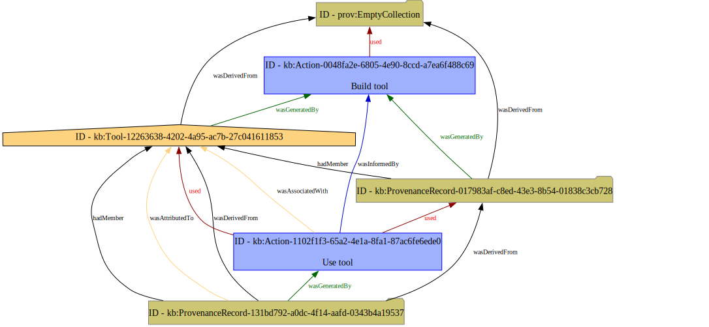

This directory holds a small example graph demonstrating the resolution to [Issue 88](https://github.com/casework/CASE-Implementation-PROV-O/issues/88).  In the figure below, `kb:Tool-12263638-...` should be styled as a `prov:Agent` (orange trapezoid), not a `prov:Entity` (yellow oval).

